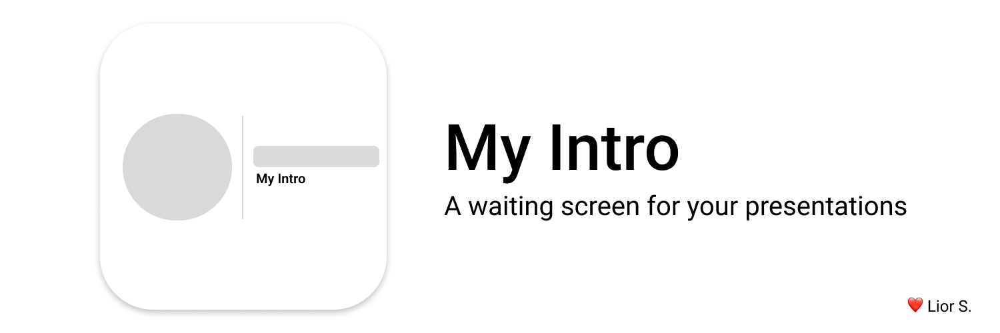

<!-- 

   <h1>MyIntro</h1>
   

        Intro tool powered by React and electron, available on Windows, Linux and MacOS.
        NOT FINISHED YET
    

 -->

   <h1>MyIntro</h1>
   

        My intro is an intro tool powered by React and electron, available on Windows, Linux and MacOS
    

## NOT FINISHED YET

---

## Motivation

There's a lot of ways to make an intro for your presentations. But there's lack of the tools to make a simple intro for your presentation. This tool is inspired by Webex

## Update Log

- Added floating button
- Reworking on the modal
- Timer has been removed completely
- Bugs fixes, templates
- Switched to Vite
